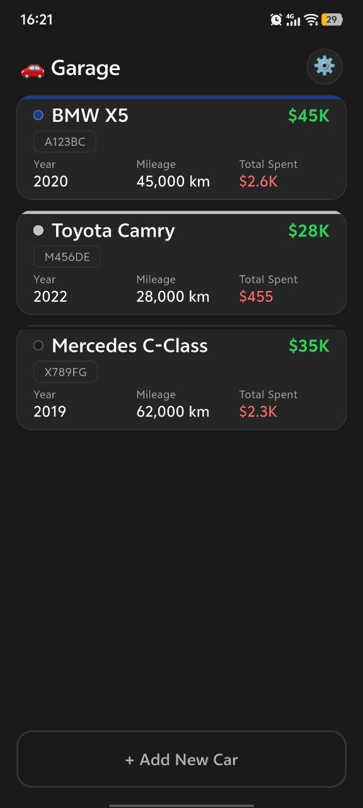
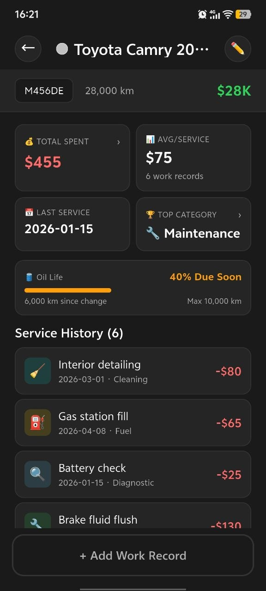
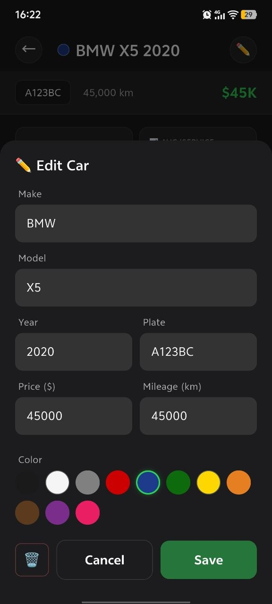
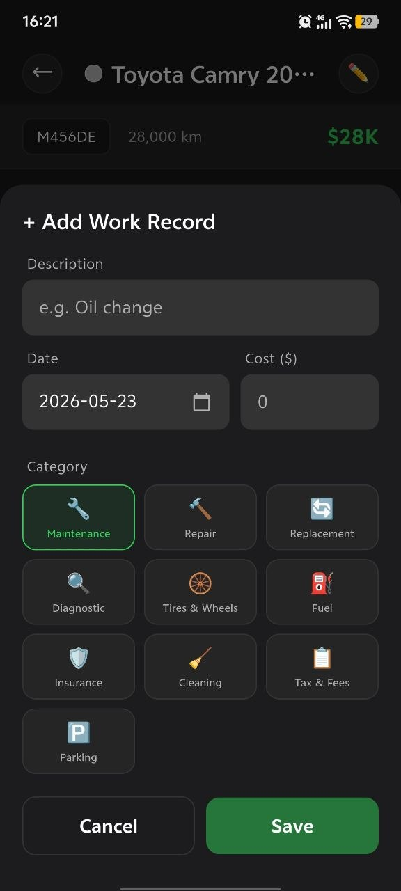
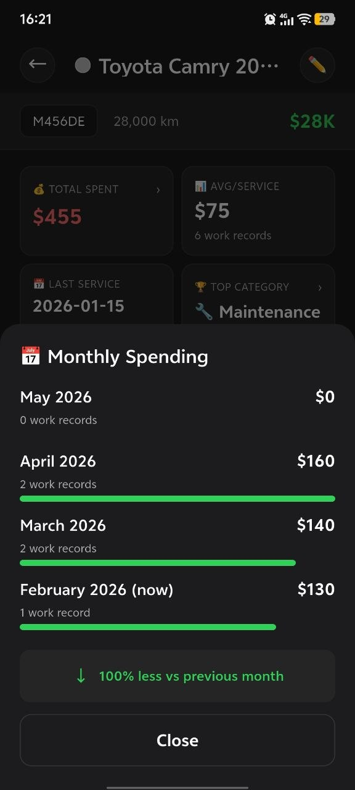
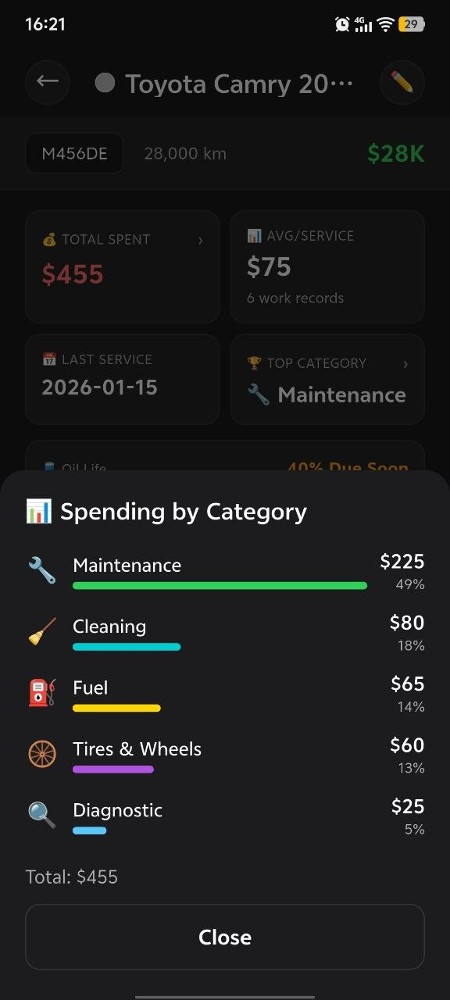
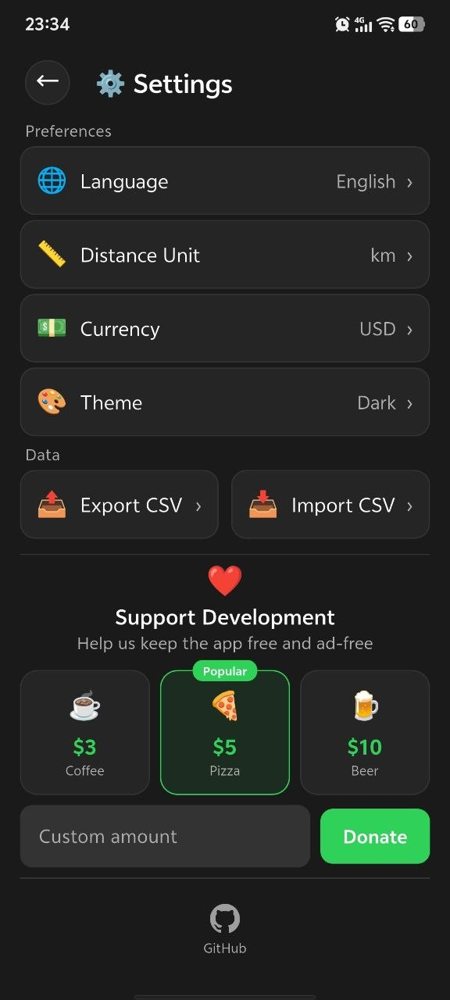

# garage_app
Your garage of cars in your phone. Track their mainteinance and daily spendings.

**Absolutely free · No ads · No tracking**

| Feature | |
|---------|-|
| Multiple cars | Track unlimited vehicles |
| Work records | Log maintenance, repairs, fuel — any expense |
| Category breakdown | See where money goes by category |
| Monthly overview | Per-month spending at a glance |
| Oil life tracking | Never miss an oil change |
| Statistics | Total spent, averages, top category |
| Dark mode | Light & dark themes |
| CSV backup | Export/import your data as CSV |
| Your data stays yours | All data stored locally on device |

## Structure

| Package | Type | Purpose |
|---------|------|---------|
| `garage_app` (lib/) | Flutter app | Orchestrates backend + ui, providers, screens, main.dart |
| `packages/backend/` | Pure Dart lib | Models, SQLite repo, formatting, i10n data. Zero Flutter imports. |
| `packages/ui/` | Flutter lib | Widgets, themes, helpers, L10nX extension. All widgets stateless. |

| Task | Command |
|------|---------|
| First-time setup | `sh init.sh` |
| Formatting | `sh format.sh` |
| Analysis | `sh analyze.sh` |
| Testing | `sh tests.sh` |

## Screenshots

| Home | Car Details | Edit Car | Add Work |
|------|-------------|----------|----------|
|  |  |  |  |

| Monthly Spent | Category Spent | Settings |
|---------------|----------------|----------|
|  |  |  |

## Build .exe and .apk
```powershell
# flutter devices
flutter run -d windows
flutter run -d V2352A

flutter build apk
flutter install -d V2352A
```

## Release HTML from mockup

```powershell
npx html-minifier `
  --remove-comments `
  --collapse-whitespace `
  --minify-css true `
  --minify-js true `
  --remove-optional-tags `
  --remove-redundant-attributes `
  --remove-script-type-attributes `
  --remove-style-type-attributes `
  --use-short-doctype `
  "mock/garage_mockup.html" -o "build/garage_mockup_release.html"
```